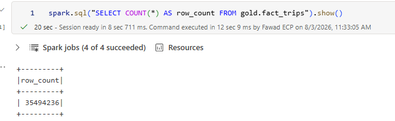
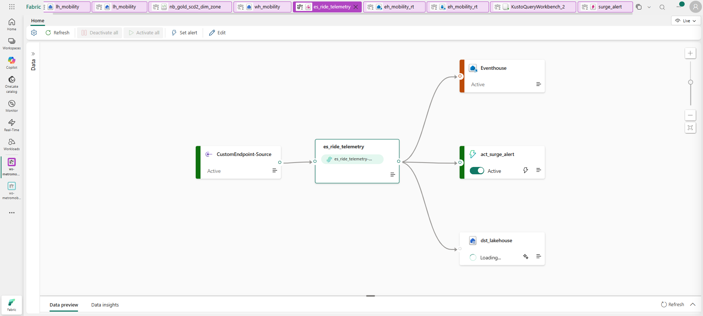
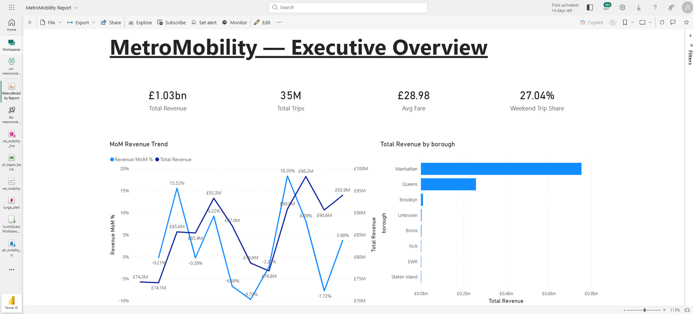
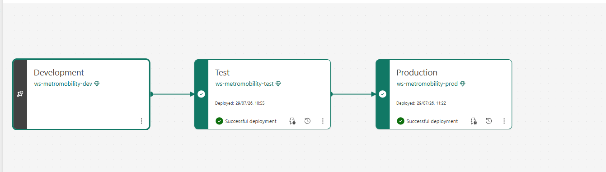
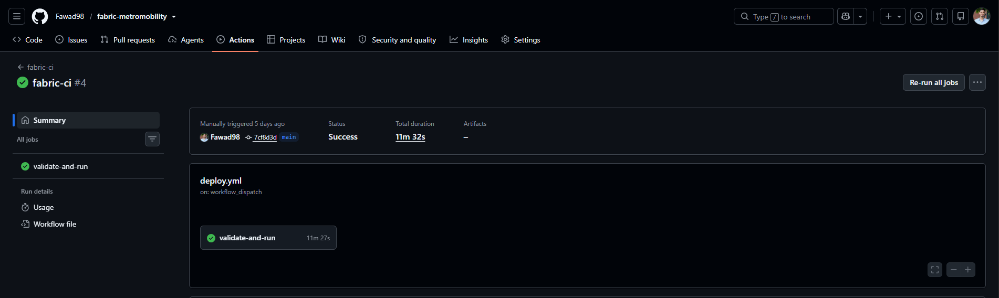

# MetroMobility — Unified Batch + Real-Time Urban Mobility Analytics on Microsoft Fabric

> An end-to-end data engineering platform that unifies large-scale batch processing and real-time streaming analytics in a single Microsoft Fabric workspace — built entirely in the cloud, with no local machine.

**▶️ [Demo video](ADD_YOUR_VIDEO_LINK_HERE)** · **Author:** Muhammad Fawad ([GitHub: Fawad98](https://github.com/Fawad98))

    

---

## What this is

MetroMobility is a production-grade analytics platform built across the full Microsoft Fabric stack. It ingests ~40 million NYC taxi trips through a metadata-driven medallion pipeline **and** processes a live stream of ride telemetry with automated alerting — two workloads most projects keep separate, here unified on one OneLake storage layer with one governance and CI/CD model.

The entire platform — including the streaming data generator — was built in the browser using the Fabric portal and GitHub Codespaces. No local dependencies.

**Companion project:** I previously built a comparable lakehouse on discrete Azure services. This repo includes an honest architectural comparison of the two approaches — assembling services with IaC versus a SaaS-unified platform — in [`docs/azure-vs-fabric-comparison.md`](docs/azure-vs-fabric-comparison.md).

---

## Architecture


```
                        ┌─────────────────────────────────────────────────┐
                        │                 MICROSOFT FABRIC                │
NYC TLC Parquet ───────►│ Data Factory Pipeline (metadata-driven)         │
(~40M rows, public)     │        │                                        │
                        │        ▼                                        │
Codespace simulator ───►│ Eventstream ──► Eventhouse (KQL)                │
(cloud streaming)       │        │              ├─► Activator (email)     │
                        │        ▼              └─► (also to lakehouse)   │
                        │ Lakehouse: bronze ─► silver ─► gold (star, SCD2)│
                        │        │                                        │
                        │        ▼                                        │
                        │ Warehouse (T-SQL, cross-DB views)               │
                        │        ▼                                        │
                        │ Power BI (Direct Lake semantic model + report)  │
                        │        +  Real-Time Dashboard (live KQL)        │
                        └─────────────────────────────────────────────────┘
          Git integration · Deployment pipeline (dev→test→prod) · GitHub Actions CI/CD
```

---

## Key metrics

| Metric | Value |
|---|---|
| Batch rows processed | ~40 million (NYC Yellow Taxi, 2024) |
| Medallion layers | Bronze → Silver → Gold (star schema, SCD Type 2) |
| Real-time path | Simulator → Eventstream → Eventhouse + Activator + Lakehouse |
| Serving model | Power BI Direct Lake (no import, no refresh) |
| Deployment | 3-stage dev → test → prod, all fully populated |
| CI/CD | GitHub Actions + fabric-cli + service principal auth |
| Environment | 100% cloud (Fabric portal + GitHub Codespaces) |

---

## The stack

**Data engineering:** Microsoft Fabric Lakehouse, PySpark notebooks, Delta Lake (V-Order, OPTIMIZE, partitioning), Data Factory pipelines
**Warehousing:** Fabric Warehouse, cross-database T-SQL, views, stored procedures
**Real-time:** Eventstream, Eventhouse (KQL), Activator, Real-Time Dashboard
**BI:** Power BI Direct Lake semantic model, DAX, role-playing dimensions
**DevOps:** Fabric Git integration, deployment pipelines, GitHub Actions, fabric-cli, Entra service principal
**Language/tooling:** Python, GitHub Codespaces

---

## How it works

### Batch — metadata-driven medallion

Ingestion is driven by a **config table**, not hardcoded per-source logic: a generic loader reads the config and ingests each source, so adding a table is a config change rather than new code.

- **Bronze** lands ~40M raw rows with audit columns (`_ingest_ts`, `_source_file`).
- **Silver** applies data-quality rules (impossible trips, negative fares, bad timestamps filtered) and persists a **data-quality metrics table** so rejections are auditable.
- **Gold** is a star schema — `fact_trips` with `dim_date`, `dim_zone`, `dim_payment` — including a **Slowly Changing Dimension Type 2** on zones to track historical changes, and a materialized lake view for pre-aggregated reporting.

Delta tables are **V-Ordered and OPTIMIZE'd**, which is what enables Direct Lake serving downstream.



### Real-time — stream, analyze, alert

A Python simulator running in a **cloud Codespace** streams synthetic ride telemetry (pickups, surge pricing, trip status) into a Fabric **Eventstream**, which fans out three ways:
- to an **Eventhouse** for live KQL analytics,
- to an **Activator** that emails an alert when the surge multiplier crosses a threshold,
- to the **lakehouse**, so real-time data also persists for historical analysis.

A **Real-Time Dashboard** with auto-refresh shows live ride volume, surge, and status.




### Serving — Direct Lake + Warehouse

A **Fabric Warehouse** runs T-SQL views and stored procedures directly over OneLake with cross-database queries (zero copies). A **Power BI Direct Lake** semantic model reads the V-Ordered Delta files directly — no import, no scheduled refresh, no DirectQuery latency — feeding a three-page report (executive overview, demand patterns, zone deep-dive) that uses a role-playing dimension (pickup vs. dropoff zone via `USERELATIONSHIP`).



### CI/CD — dev → test → prod

- **Git integration** syncs Fabric items to this repo.
- A **3-stage deployment pipeline** (dev → test → prod) promotes item definitions across fully populated workspaces.
- **GitHub Actions** authenticates as an **Entra service principal** via fabric-cli and triggers pipeline runs — turning manual portal deploys into automated CI/CD.




---

## Engineering challenges solved

The real learning of this project was in the failures. A selection (full detail in [`docs/challenges-and-solutions.md`](docs/challenges-and-solutions.md)):

- **Delta type-merge failure (`DELTA_FAILED_TO_MERGE_FIELDS`)** — `inferSchema` produced an int-vs-bigint mismatch between a base dimension and hand-built SCD2 update rows, breaking the append. Resolved by explicit type casting and pinning bronze schema.
- **Cross-stage warehouse deployment failure (`DmsImportDatabaseException`)** — the warehouse's cross-database views reference lakehouse tables that deployment pipelines don't populate. Established the correct promotion order: lakehouse → run ingestion in-stage → warehouse.
- **Notebook schema/binding drift across stages (`SCHEMA_NOT_FOUND`)** — promoted notebooks didn't rebind their default lakehouse and target schemas didn't exist. Hardened notebooks with `CREATE SCHEMA IF NOT EXISTS` bootstrapping and documented the rebinding step.
- **Capacity throttling (`HTTP 430 TooManyRequestsForCapacity`)** — concurrent Spark jobs on trial capacity hit the compute ceiling. Managed via session cleanup in the Monitoring hub and analyzed CU consumption in the Capacity Metrics app.
- **fabric-cli auth in CI** — the GitHub Actions runner has no OS keyring for the encrypted token cache; resolved with the documented `encryption_fallback_enabled` pattern before login.
- **CLI syntax verification** — verified `fab job run` against the actual installed CLI rather than trusting a single doc example (docs showed both `fab run` and `fab job run`; only the latter existed).
- **Git divergence** — Fabric Git integration and Codespace commits diverged on `main`; adopted a merge-based pull-before-push discipline.

---

## Repository structure

```
fabric-metromobility/
├── eh_mobility_rt.Eventhouse/          # Fabric items, synced via Git integration
├── es_ride_telemetry.Eventstream/
├── lh_mobility.Lakehouse/
├── MetroMobility Report.Report/
├── rtd_mobility_live.KQLDashboard/
├── sm_mobility.SemanticModel/
├── surge_alert.Reflex/                 # Activator (surge-alert rule)
├── wh_mobility.Warehouse/
├── pl_ingest_batch.DataPipeline/       # Orchestration pipeline
├── nb_bronze_acquire_tlc.Notebook/     # PySpark notebooks
├── nb_bronze_ingest.Notebook/
├── nb_silver_clean_trips.Notebook/
├── nb_gold_dimensional_model.Notebook/
├── nb_gold_scd2_dim_zone.Notebook/
├── simulator/                          # Cloud ride-telemetry generator
├── .github/workflows/                  # GitHub Actions CI/CD
├── docs/                               # design decisions, challenges, runbook, comparison
│   ├── design-decisions.md
│   ├── challenges-and-solutions.md
│   ├── operations-runbook.md
│   ├── azure-vs-fabric-comparison.md
│   └── images/
└── README.md
```

---

## What I'd do differently

- Parameterize notebook lakehouse bindings for cleaner cross-stage promotion rather than manual rebinding.
- Add a data-quality gate between silver and gold that fails the pipeline above a rejection threshold.
- On a paid capacity, populate all three stages via automated in-stage runs rather than conserving trial compute.

---

## Notes on scope

This is a portfolio/demonstration project. Workloads are sized for cheap iteration on Fabric trial capacity, favoring fast development over maximum throughput. Dev is the primary demo environment; test and prod hold promoted definitions and were validated end-to-end. These trade-offs are documented honestly in `docs/` rather than hidden — including where trial-capacity limits shaped decisions.
